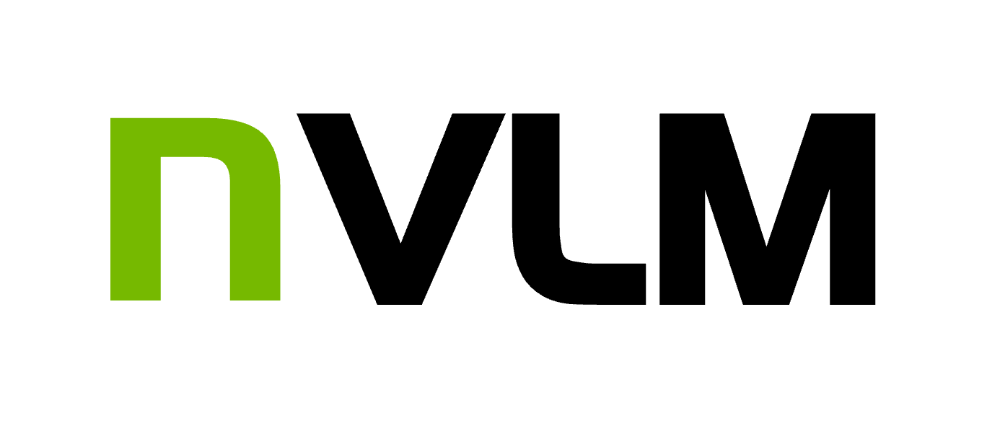

<p align="center">
  
</p>


# Model Overview

## Description
This family of models performs vision-language and text-only tasks including optical character recognition, multimodal reasoning, localization, common sense reasoning, world knowledge utilization, and coding.

## License/Terms of Use
[Creative Commons Attribution: Non-Commercial 4.0 International](https://spdx.org/licenses/CC-BY-NC-4.0) <br>

# Model Details

Today (September 17th, 2024), we introduce [NVLM 1.0](https://arxiv.org/abs/2409.11402), a family of frontier-class multimodal large language models (LLMs) that achieve state-of-the-art results on vision-language tasks, rivaling the leading proprietary models (e.g., GPT-4o) and open-access models (e.g., Llama 3-V 405B and InternVL 2). Remarkably, NVLM 1.0 shows improved text-only performance over its LLM backbone after multimodal training. 

In this repo, we are open-sourcing NVLM-1.0-D-72B (decoder-only architecture), the decoder-only model weights and code for the community.


## Reference(s)
[Paper](https://arxiv.org/abs/2409.11402) &ensp; [Inference Code (HF)](https://huggingface.co/nvidia/NVLM-D-72B/tree/main) &ensp; [Training Code (Coming soon)]() &ensp; [Website](https://research.nvidia.com/labs/adlr/NVLM-1/) 

## Benchmark Results
We train our model with legacy [Megatron-LM](https://github.com/NVIDIA/Megatron-LM/tree/main/megatron/legacy) and adapt the codebase to Huggingface for model hosting, reproducibility, and inference.
We observe numerical differences between the Megatron and Huggingface codebases, which are within the expected range of variation. 
We provide the results from both the Huggingface codebase and the Megatron codebase for reproducibility and comparison with other models.

Results (as of September 17th, 2024) in the multimodal benchmarks are as follows:

### Vision-language Benchmarks 

| Benchmark                    | MMMU (val / test) | MathVista | OCRBench | AI2D | ChartQA | DocVQA | TextVQA | RealWorldQA | VQAv2 |
|------------------------------|-------------------|-----------|----------|------|---------|--------|---------|-------------|-------|
| NVLM-D 1.0 72B (Huggingface) | 58.7 / 54.9       | 65.2      | 852      | 94.2 | 86.0    | 92.6   | 82.6    | 69.5        | 85.4  |
| NVLM-D 1.0 72B (Megatron)    | 59.7 / 54.6       | 65.2      | 853      | 94.2 | 86.0    | 92.6   | 82.1    | 69.7        | 85.4  |
| Llama 3.2 90B                | 60.3 / -          | 57.3      | -        | 92.3 | 85.5    | 90.1   | -       | -           | 78.1  |
| Llama 3-V 70B                | 60.6 / -          | -         | -        | 93.0 | 83.2    | 92.2   | 83.4    | -           | 79.1  |
| Llama 3-V 405B               | 64.5 / -          | -         | -        | 94.1 | 85.8    | 92.6   | 84.8    | -           | 80.2  |
| InternVL2-Llama3-76B         | 55.2 / -          | 65.5      | 839      | 94.8 | 88.4    | 94.1   | 84.4    | 72.2        | -     |
| GPT-4V                       | 56.8 / 55.7       | 49.9      | 645      | 78.2 | 78.5    | 88.4   | 78.0    | 61.4        | 77.2  |
| GPT-4o                       | 69.1 / -          | 63.8      | 736      | 94.2 | 85.7    | 92.8   | -       | -           | -     |
| Claude 3.5 Sonnet            | 68.3 / -          | 67.7      | 788      | 94.7 | 90.8    | 95.2   | -       | -           | -     |
| Gemini 1.5 Pro (Aug 2024)    | 62.2 / -          | 63.9      | 754      | 94.4 | 87.2    | 93.1   | 78.7    | 70.4        | 80.2  |

### Text-only Benchmarks

| Tasks                        | Backbone LLM | MMLU | GSM8K | MATH | HumanEval | Avg. Accuracy    |
|------------------------------|--------------|------|-------|------|-----------|------------------|
| **Proprietary**              |              |      |       |      |           |                  |
| GPT-4.0                      | N/A          | 88.7 | -     | 76.6 | 90.2      | -                |
| Gemini Pro 1.5 (Aug 2024)    | N/A          | 85.9 | 90.8  | 67.7 | 84.1      | 82.1             |
| Claude 3.5 Sonnet            | N/A          | 88.7 | 96.4  | 71.1 | 92.0      | 87.0             |
| **Open LLM**                 |              |      |       |      |           |                  |
| (a) Nous-Hermes-2-Yi-34B     | N/A          | 75.5 | 78.6  | 21.8 | 43.3      | 54.8             |
| (b) Qwen-72B-Instruct        | N/A          | 82.3 | 91.1  | 59.7 | 86.0      | 79.8             |
| (c) Llama-3-70B-Instruct     | N/A          | 82.0 | 93.0  | 51.0 | 81.7      | 76.6             |
| (d) Llama-3.1-70B-Instruct   | N/A          | 83.6 | 95.1  | 68.0 | 80.5      | 81.8             |
| (e) Llama-3.1-405B-Instruct  | N/A          | 87.3 | 96.8  | 73.8 | 89.0      | 86.7             |
| **Open Multimodal LLM**      |              |      |       |      |           |                  |
| VILA-1.5 40B                 | (a)          | 73.3 | 67.5  | 16.8 | 34.1      | 🥶 47.9   (-6.9) |
| LLaVA-OneVision 72B          | (b)          | 80.6 | 89.9  | 49.2 | 74.4      | 🥶 73.5   (-6.3) |
| InternVL-2-Llama3-76B        | (c)          | 78.5 | 87.1  | 42.5 | 71.3      | 🥶 69.9   (-6.7) |
| *Llama 3-V 70B               | (d)          | 83.6 | 95.1  | 68.0 | 80.5      | 🙂 81.8   (0)    |
| *Llama 3-V 405B              | (e)          | 87.3 | 96.8  | 73.8 | 89.0      | 🙂 86.7   (0)    |
| NVLM-D 1.0 72B (Megatron)    | (b)          | 82.0 | 92.9  | 73.1 | 88.4      | 🥳 84.1   (+4.3) |
| NVLM-D 1.0 72B (Huggingface) | (b)          | 81.7 | 93.2  | 73.1 | 89.0      | 🥳 84.3   (+4.5) |


## Model Architectures

**Network Architecture:** Decoder-Only Transformer 

### Input
**Input Type(s):** Text, Image <br>
**Input Format(s):** String, [Pillow Library-Supported Formats](https://pillow.readthedocs.io/en/stable/handbook/image-file-formats.html) <br>
**Input Dimensions:** One-Dimensional (1D), Two Dimensional (2D) <br>
**Other Properties Related to Input:** Maximum Token Length = 128K Tokens <br>

### Output
**Output Type(s):** Text <br>
**Output Format:** String <br>
**Model Output:** 1D <br>
**Other Properties Related to Output:** None <br> 

## How to use

When converting Megatron checkpoint to Huggingface, we adapt [InternVL codebase](https://huggingface.co/OpenGVLab/InternVL2-Llama3-76B) to support model loading and multi-GPU inference in HF. 
We also use the tokenizer from [Qwen2.5-72B-Instruct](https://huggingface.co/Qwen/Qwen2.5-72B-Instruct/tree/main) when adapting the tokenizer to Huggingface, as it contains extra special tokens for vision tasks, e.g., `<|vision_pad|>`. 
We train NVLM-1.0-D-72B based on the [Qwen2-72B-Instruct](https://huggingface.co/Qwen/Qwen2-72B-Instruct/tree/main) text-only model and [InternViT-6B-448px-V1-5](https://huggingface.co/OpenGVLab/InternViT-6B-448px-V1-5) ViT model with our large-scale high-quality multimodal dataset. 
For training code, please refer to [Megatron-LM (Coming soon)]().


### Prepare the environment

We provide a docker build file in the [Dockerfile](Dockerfile) for reproduction. 

The docker image is based on `nvcr.io/nvidia/pytorch:23.09-py3`. 

*Note: We observe that different transformer versions / CUDA versions / docker versions can lead to slight benchmark number differences. We recommend using the Dockerfile above for precise reproduction.*

### Model loading

```python
import torch
from transformers import AutoModel

path = "nvidia/NVLM-D-72B"
model = AutoModel.from_pretrained(
    path,
    torch_dtype=torch.bfloat16,
    low_cpu_mem_usage=True,
    use_flash_attn=False,
    trust_remote_code=True).eval()
```

### Multiple GPUs

The model can be loaded on multiple GPUs as follows:

```python
import torch
import math
from transformers import AutoModel

def split_model():
    device_map = {}
    world_size = torch.cuda.device_count()
    num_layers = 80
    # Since the first GPU will be used for ViT, treat it as half a GPU.
    num_layers_per_gpu = math.ceil(num_layers / (world_size - 0.5))
    num_layers_per_gpu = [num_layers_per_gpu] * world_size
    num_layers_per_gpu[0] = math.ceil(num_layers_per_gpu[0] * 0.5)
    layer_cnt = 0
    for i, num_layer in enumerate(num_layers_per_gpu):
        for j in range(num_layer):
            device_map[f'language_model.model.layers.{layer_cnt}'] = i
            layer_cnt += 1
    device_map['vision_model'] = 0
    device_map['mlp1'] = 0
    device_map['language_model.model.tok_embeddings'] = 0
    device_map['language_model.model.embed_tokens'] = 0
    device_map['language_model.output'] = 0
    device_map['language_model.model.norm'] = 0
    device_map['language_model.lm_head'] = 0
    device_map['language_model.model.rotary_emb'] = 0
    device_map[f'language_model.model.layers.{num_layers - 1}'] = 0

    return device_map

path = "nvidia/NVLM-D-72B"
device_map = split_model()
model = AutoModel.from_pretrained(
    path,
    torch_dtype=torch.bfloat16,
    low_cpu_mem_usage=True,
    use_flash_attn=False,
    trust_remote_code=True,
    device_map=device_map).eval()
```


### Inference

```python
import torch
from transformers import AutoTokenizer, AutoModel
import math
from PIL import Image
import torchvision.transforms as T
from torchvision.transforms.functional import InterpolationMode


def split_model():
    device_map = {}
    world_size = torch.cuda.device_count()
    num_layers = 80
    # Since the first GPU will be used for ViT, treat it as half a GPU.
    num_layers_per_gpu = math.ceil(num_layers / (world_size - 0.5))
    num_layers_per_gpu = [num_layers_per_gpu] * world_size
    num_layers_per_gpu[0] = math.ceil(num_layers_per_gpu[0] * 0.5)
    layer_cnt = 0
    for i, num_layer in enumerate(num_layers_per_gpu):
        for j in range(num_layer):
            device_map[f'language_model.model.layers.{layer_cnt}'] = i
            layer_cnt += 1
    device_map['vision_model'] = 0
    device_map['mlp1'] = 0
    device_map['language_model.model.tok_embeddings'] = 0
    device_map['language_model.model.embed_tokens'] = 0
    device_map['language_model.output'] = 0
    device_map['language_model.model.norm'] = 0
    device_map['language_model.lm_head'] = 0
    device_map['language_model.model.rotary_emb'] = 0
    device_map[f'language_model.model.layers.{num_layers - 1}'] = 0

    return device_map


IMAGENET_MEAN = (0.485, 0.456, 0.406)
IMAGENET_STD = (0.229, 0.224, 0.225)


def build_transform(input_size):
    MEAN, STD = IMAGENET_MEAN, IMAGENET_STD
    transform = T.Compose([
        T.Lambda(lambda img: img.convert('RGB') if img.mode != 'RGB' else img),
        T.Resize((input_size, input_size), interpolation=InterpolationMode.BICUBIC),
        T.ToTensor(),
        T.Normalize(mean=MEAN, std=STD)
    ])
    return transform


def find_closest_aspect_ratio(aspect_ratio, target_ratios, width, height, image_size):
    best_ratio_diff = float('inf')
    best_ratio = (1, 1)
    area = width * height
    for ratio in target_ratios:
        target_aspect_ratio = ratio[0] / ratio[1]
        ratio_diff = abs(aspect_ratio - target_aspect_ratio)
        if ratio_diff < best_ratio_diff:
            best_ratio_diff = ratio_diff
            best_ratio = ratio
        elif ratio_diff == best_ratio_diff:
            if area > 0.5 * image_size * image_size * ratio[0] * ratio[1]:
                best_ratio = ratio
    return best_ratio


def dynamic_preprocess(image, min_num=1, max_num=12, image_size=448, use_thumbnail=False):
    orig_width, orig_height = image.size
    aspect_ratio = orig_width / orig_height

    # calculate the existing image aspect ratio
    target_ratios = set(
        (i, j) for n in range(min_num, max_num + 1) for i in range(1, n + 1) for j in range(1, n + 1) if
        i * j <= max_num and i * j >= min_num)
    target_ratios = sorted(target_ratios, key=lambda x: x[0] * x[1])

    # find the closest aspect ratio to the target
    target_aspect_ratio = find_closest_aspect_ratio(
        aspect_ratio, target_ratios, orig_width, orig_height, image_size)

    # calculate the target width and height
    target_width = image_size * target_aspect_ratio[0]
    target_height = image_size * target_aspect_ratio[1]
    blocks = target_aspect_ratio[0] * target_aspect_ratio[1]

    # resize the image
    resized_img = image.resize((target_width, target_height))
    processed_images = []
    for i in range(blocks):
        box = (
            (i % (target_width // image_size)) * image_size,
            (i // (target_width // image_size)) * image_size,
            ((i % (target_width // image_size)) + 1) * image_size,
            ((i // (target_width // image_size)) + 1) * image_size
        )
        # split the image
        split_img = resized_img.crop(box)
        processed_images.append(split_img)
    assert len(processed_images) == blocks
    if use_thumbnail and len(processed_images) != 1:
        thumbnail_img = image.resize((image_size, image_size))
        processed_images.append(thumbnail_img)
    return processed_images


def load_image(image_file, input_size=448, max_num=12):
    image = Image.open(image_file).convert('RGB')
    transform = build_transform(input_size=input_size)
    images = dynamic_preprocess(image, image_size=input_size, use_thumbnail=True, max_num=max_num)
    pixel_values = [transform(image) for image in images]
    pixel_values = torch.stack(pixel_values)
    return pixel_values

path = "nvidia/NVLM-D-72B"
device_map = split_model()
model = AutoModel.from_pretrained(
    path,
    torch_dtype=torch.bfloat16,
    low_cpu_mem_usage=True,
    use_flash_attn=False,
    trust_remote_code=True,
    device_map=device_map).eval()

print(model)

tokenizer = AutoTokenizer.from_pretrained(path, trust_remote_code=True, use_fast=False)
generation_config = dict(max_new_tokens=1024, do_sample=False)

# pure-text conversation
question = 'Hello, who are you?'
response, history = model.chat(tokenizer, None, question, generation_config, history=None, return_history=True)
print(f'User: {question}\nAssistant: {response}')

# single-image single-round conversation
pixel_values = load_image('path/to/your/example/image.jpg', max_num=6).to(
    torch.bfloat16)
question = '<image>\nPlease describe the image shortly.'
response = model.chat(tokenizer, pixel_values, question, generation_config)
print(f'User: {question}\nAssistant: {response}')
```

## Software Integration
**Runtime Engine(s)** 
* PyTorch <br>

**Supported Hardware Microarchitecture Compatibility:** <br>
* NVIDIA Hopper <br>

**[Preferred/Supported] Operating System(s):** <br>
* Linux <br>

## Inference
**Engine:** PyTorch <br>
**Test Hardware:** <br>
* H100 <br>

## Model Version(s)
* v1.0-D (NVLM-D)

## Training, Testing, and Evaluation Datasets 

### Pre-Training Dataset

**Link** <br>
* [See Table 4](https://arxiv.org/abs/2409.11402) <br>

**Data Collection Method by dataset** <br>
* Hybrid: Automated, Human, Synthetic, Unknown <br>

**Labeling Method by dataset** <br>
* Hybrid: Automated, Human, Synthetic, Unknown <br>

**Properties** 
* Trained on image captions, image-text pairs, natural images, charts, documents, scene descriptions, and mathematical reasoning. <br>

### Supervised Fine-Tuning Dataset
**Link** <br>
* [See Table 6](https://arxiv.org/abs/2409.11402) <br>

**Data Collection Method by dataset** <br>
* Hybrid: Automated, Human, Synthetic, Unknown <br>

**Labeling Method by dataset** <br>
* Hybrid: Automated, Human, Synthetic, Unknown <br>

**Properties** 
* Trained on image captions; general knowledge; image-text pairs; natural images; charts; diagrams; documents; scene descriptions; science diagrams, lessons, textbook data, and question-answer pairs; visual instruction tuning; and mathematical reasoning. <br>

### Evaluation Dataset
**Link** <br>
* [See Section 6.1, "Benchmark"](https://arxiv.org/abs/2409.11402) <br>

**Data collection method by dataset** <br>
* Human <br>

**Labeling method by dataset** <br>
* Human <br>

**Properties** <br>
* Evaluated on general knowledge, visual answering, chart understanding, table, optical character recognition, and mathematical reasoning. <br> 


## Correspondence to
Wenliang Dai* (wdai@nvidia.com), Nayeon Lee* (nayeonl@nvidia.com), Boxin Wang* (boxinw@nvidia.com), Zhuolin Yang* (zhuoliny@nvidia.com), Wei Ping* (wping@nvidia.com)

*Equal contribution

## Citation
<pre>
@article{nvlm2024,
  title={NVLM: Open Frontier-Class Multimodal LLMs},
  author={Dai, Wenliang and Lee, Nayeon and Wang, Boxin and Yang, Zhuolin and Liu, Zihan and Barker, Jon and Rintamaki, Tuomas and Shoeybi, Mohammad and Catanzaro, Bryan and Ping, Wei},
  journal={arXiv preprint},
  year={2024}}
</pre>


## Ethical Considerations
NVIDIA believes Trustworthy AI is a shared responsibility and we have established policies and practices to enable development for a wide array of AI applications.  When downloaded or used in accordance with our terms of service, developers should work with their internal model team to ensure this model meets requirements for the relevant industry and use case and addresses unforeseen product misuse.    

Please report security vulnerabilities or NVIDIA AI Concerns [here](https://www.nvidia.com/en-us/support/submit-security-vulnerability/).
 